# Agentic Multimodal App · Architecture Design

Authoritative design. **Build rule:** never hand-roll what an NVIDIA blueprint/skill
provides — deploy/configure it via its skill. Custom code only where no skill is the
SME (and it's flagged as a *proposal*). Design is signed off before implementation;
each phase has a **confirmation gate**.

> **Reusable skeleton.** **Sherlock** (a forensic co-worker) is the *worked example*
> used throughout — retarget to another domain by swapping configured tools, prompts,
> and data; the layers and method stay the same.

Implementation reviewed against `main` commit `797c08c` on 2026-10-02. The original
problem, design rationale and phased plan are retained below. This is a developer
enablement PoC: developers can pick individual NVIDIA modules and adapt their own
architecture. Product requirements and future deployment targets are distinguished
from the currently wired capabilities. Detailed tool/framework references remain in
[DESIGN-EXT.md](DESIGN-EXT.md) and [AGENTS.md](AGENTS.md).

---

## 1. Problem statement

An **agentic co-worker for forensic investigators ("Sherlock")**. It ingests
**seized multimodal evidence** — photos from confiscated phones/laptops, **audio
statements (口供)**, and **WhatsApp/chat text** — and autonomously **plans and
performs**: **entity recognition** across all assets, **relationship-graph**
construction, and **sentiment / paralinguistic** analysis. The design aims for
**court-defensible cited findings**, with a **human-in-the-loop** approving each
consequential step. It turns today's **click-through** forensic app into an
**agentic** one, on **NVIDIA blueprints/SDKs as much as possible**.

The customer explicitly wants the **"middle ground"**, *not* full autonomy:
a co-agent that **proposes**, the investigator **approves**. Accountability is
mandatory; the agent advises, the human decides.

**Current PoC:** text retrieval, TXT entity extraction, audio processing and on-demand
video tools are implemented with limitations. Images can be stored/viewed but have
no analysis worker. The UI offers approval feedback; it does not enforce a server-side
tool gate. Court defensibility and consequential-step approval remain product goals.

### Personas
- **Developer** — assembles the app from NVIDIA components via the skills (see [QUICKSTART_DEVELOPER.md](QUICKSTART_DEVELOPER.md)).
- **Investigator (user)** — works a case in the UI; approves each step; reads cited findings.

### Hard constraints

These describe the original production target. The current workshop PoC mixes hosted
inference and local services; it does not implement a complete offline deployment.
- **Air-gapped**: no internet at runtime. ⇒ **NIMs self-hosted** in production
  (GB10 / RTX PRO 6000, FP8); **AI-Q deep research runs over internal storage only,
  web search OFF**. Hosted NIMs (`build.nvidia.com`) allowed for **dev only**.
- **Orchestration + config overlay**: this repo deploys/configures the blueprints
  (skills clone them); it does **not** vendor or fork blueprint source.

---

## 2. Layered architecture

```
 INVESTIGATOR (browser)
        │ HTTPS / SSE
 ┌──────▼─────────────── UI LAYER — custom case workbench ──────────────────────────────────────┐
 │ multimodal intake · chat · PLAN+APPROVE (HITL) · relationship-graph view ·                   │
 │ cited findings/report · sentiment panel · evidence viewer                                    │
 └──────┬───────────────────────────────────────────────────────────────────────────────────────┘
        │ REST/SSE
 ┌──────▼──── AGENT LAYER — AI-Q lead agent + tools ────────────────────────────────────────────┐
 │ LEAD AGENT = AI-Q (the single user-facing co-worker "Sherlock"):                             │
 │   Active: shallow_research_workflow → shallow researcher → tool loop                         │
 │   Deep/clarifier definitions inactive here; forensic prompts; WEB OFF.                       │
 │   ├─ VIDEO TOOLS via custom MCP (mcp/vss_sherlock_mcp.py :9903) →                            │
 │   │     rtvi-vlm /v1/chat/completions (vLLM); vss-lvs as fallback                            │
 │   ├─ KNOWLEDGE LAYER (text/docs/transcripts): RAG-BP via FRAG                                │
 │   └─ TOOLS/SKILLS (no agent): transcribe→Parakeet/Canary · paralinguistics→                  │
 │         MERaLiON · graph_query/analyze→Neo4j+NetworkX · sentiment · ER-extract               │
 │ Accountability target: enforced approval + policy; UI feedback only today                    │
 └──────┬───────────────────────────────────────────────────────────────────────────────────────┘
 ┌──────▼──────────────── NVIDIA COMPONENT LAYER ───────────────────────────────────────────────┐
 │ AI-Q (headless, active shallow research; FRAG knowledge retrieval)                           │
 │ RAG Blueprint: rag-server · ingestor/NV-Ingest · embed+rerank NIM · VLM                      │
 │ VSS: VIOS registration · RT-VLM Q&A; caption/graph persistence not wired                     │
 │ Speech: Parakeet ASR (Canary opt) ·  MERaLiON (self-hosted, paralinguistics)                 │
 │ LLM/VLM services (hosted/local) · Guardrails/Content-Safety planned                          │
 │ NeMo Agent Toolkit (obs/eval/profiling) · aiperf · Nsight                                    │
 └──────┬───────────────────────────────────────────────────────────────────────────────────────┘
 ┌──────▼──────────────── STORAGE LAYER (shared) ───────────────────────────────────────────────┐
 │ BLOB: local case files + VIOS video; SeaweedFS for RAG ingestion                             │
 │ VECTOR: one Elasticsearch (RAG-BP + VSS default) — embeddings; Milvus/cuVS                   │
 │         optional GPU/prod swap                                                               │
 │ GRAPH: Neo4j — custom text entities; no upload-time VSS video ER                             │
 │ RELATIONAL: Postgres — AI-Q jobs/checkpoints; case registry is on disk                       │
 └──────────────────────────────────────────────────────────────────────────────────────────────┘
```

### Layer responsibilities
- **UI** — purpose-built case workbench (neither AI-Q's research UI nor VSS's video
  UI fit). Requirements in §4.
- **Agent** — **AI-Q is the lead agent** (the single user-facing co-worker). It is
  *not* wrapped in another supervisor — AI-Q provides workflow/research components;
  the current config uses **shallow research**, with built-in plan approval disabled. We **extend AI-Q via
  its own points**: Knowledge Layer (RAG-BP/FRAG) for text/docs/transcripts, **MCP** for
  video, and Custom Skills/tools for speech/graph/sentiment.
  **Video is reached as a tool, not as a sub-agent.** The original design called for
  `vss-agent` as an agent-in-agent over VSS's own MCP (`LVS_ENABLE_MCP`); in
  implementation that path added ~31 s of vss-agent overhead and dropped MCP sessions,
  so `LVS_ENABLE_MCP` stays **off** and a custom MCP server
  (`mcp/vss_sherlock_mcp.py`, :9903) calls the VLM directly. The ~4 s result is
  historical host-specific evidence, not a response-time guarantee. HTTP fallbacks
  to LVS/vss-agent remain in the tool code. **Sherlock therefore
  has no agent-in-agent** — every capability below the lead agent is a plain tool.
  Accountability remains the design goal: UI approval is chat feedback and guardrails
  are drafted, not enforced. Web search is OFF; hosted model calls remain.
  NeMo Agent Toolkit underlies execution/integration and **instruments/evaluates**
  the workflow (it is not itself an agent).
- **NVIDIA components** — capabilities the agent calls; each deployed via its skill.
- **Storage** — share Elasticsearch/Redis where configured; VSS takes ownership on
  the full-video path. Case files, RAG objects and VIOS assets have separate roles.
  Postgres is not the case registry; see §8 for what each modality actually writes.


### Current request paths (read each row independently)

All rows start at the same AI-Q lead agent. The Workbench proxies questions to it;
the agent chooses tools rather than executing every row as a fixed pipeline. Splitting
these views keeps each module connection explicit.

**Document retrieval:**

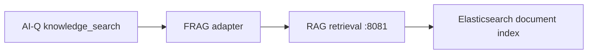

**Graph/audio tools:**

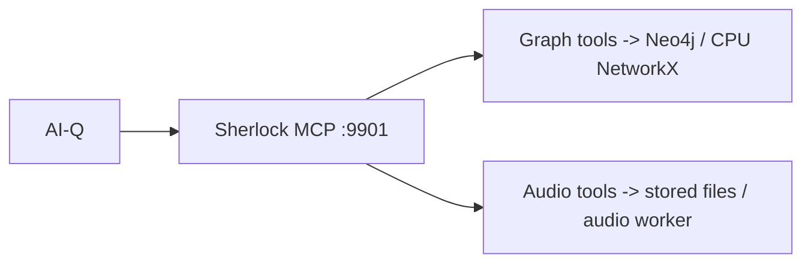

**Video inference (preferred path):**

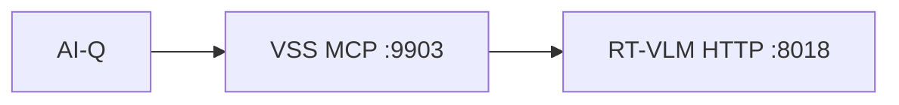

Video asset resolution, registration and HTTP fallbacks are shown separately in §8.6.

---

## 3. Component decisions (overlap resolved)

| Concern | Decision | Skill / source |
|---|---|---|
| **Lead agent** (single user-facing co-worker) | **AI-Q**, forensic-configured, **web OFF**; active shallow workflow; UI approval feedback | `aiq-deploy`, `aiq-research` |
| **Video** | **Custom MCP server** (`mcp/vss_sherlock_mcp.py`, :9903) → rtvi-vlm `/v1/chat/completions`. `LVS_ENABLE_MCP` stays off — see §2 | `vss-deploy-profile`, `vss-summarize-video` |
| Knowledge Layer (text/docs/transcripts; image captions future) | **RAG Blueprint** via AI-Q **FRAG** | `rag-blueprint` + `aiq frag` |
| Agent orchestration framework | AI-Q configured workflow on **NeMo Agent Toolkit** (execution/integration, tracing/eval; *not* an agent) | NAT docs |
| ~~Lightweight RAG~~ | **dropped** (overlaps RAG-BP) | ~~`nemo-retriever`~~ |
| ASR | **Parakeet** hosted NVCF (primary); alternatives configurable, no automatic language router | `nemotron-speech` |
| Paralinguistics / Singlish-SEA | **MERaLiON-3** (self-hosted) | *custom — no skill* |
| Guardrails / HITL policy | NeMo Guardrails + Content-Safety remain planned; draft policy only | `nemotron-policy-generator` + RAG-BP |
| Obs / eval / profiling | NeMo Agent Toolkit + Phoenix; aiperf; Nsight | NAT docs |
| Synthetic demo data | NeMo Data Designer | `data-designer` |
| Vector store | **one Elasticsearch** (RAG-BP + VSS default) — shared; **Milvus/cuVS optional** GPU/prod swap | RAG-BP `docker-nvidia-hosted.md`; VSS CA-RAG `elasticsearch_db` |
| Graph store | **one Neo4j** (Community; custom TXT ER, case properties); NetworkX CPU analysis, no cuGraph | custom ER + graph tools; VSS video ER not wired |

### FRAG pattern — why external RAG-BP over AI-Q built-in RAG

AI-Q ships with a built-in retrieval capability (vector search inside the agent container).
We do **not** use it. Instead we use **FRAG** — AI-Q's extension point that delegates
all knowledge-layer queries to an external RAG service over HTTP.

```
Investigator question
  → AI-Q (reasons, plans, calls tools)
      → knowledge_search tool  ← FRAG adapter
          → RAG Blueprint rag-server :8081
              → Elasticsearch (embed + retrieve + re-rank)
          ← cited chunks + source attribution
      ← AI-Q wraps into final cited answer
```

**Why FRAG / external RAG-BP over AI-Q built-in:**

| Requirement | Built-in AI-Q RAG | RAG Blueprint via FRAG |
|---|---|---|
| Multimodal ingest (PDFs, audio transcripts, future image captions) | Limited | NV-Ingest handles supported formats; Workbench image/audio-derived-text wiring is separate |
| Shared vector store (RAG-BP + VSS both write to one Elasticsearch) | Not possible — internal to AI-Q | ES is external, both stacks can point at it; video captions are not indexed by the upload worker |
| Agentic retrieval quality (query decomposition → multi-retrieval → synthesis) | Basic retrieval only | RAG generation can use its planner; current FRAG path retrieves chunks for AI-Q synthesis |
| Independent swap (Elasticsearch → Milvus, embedding model change) | Swap requires AI-Q rebuild | Supported RAG backend/model configuration can change independently; custom backends require adapters |
| Evidence ingest at case time (workbench `POST /documents`) | No REST ingest API | ingestor-server :8082 accepts multipart uploads |

**Separation of concerns (the principle):**
AI-Q owns *reasoning and orchestration*. RAG-BP owns *ingestion and retrieval* here; its generation API is a separate capability.
Either can be replaced without touching the other.
`RAG_SERVER_URL`, ingestion URL and `COLLECTION_NAME` configure the integration.
A replacement service must satisfy the `foundational_rag` adapter/API contract;
changing a URL alone does not make an arbitrary RAG backend compatible.

**Important:** `ENABLE_AGENTIC_RAG=true` configures RAG's generation path; it does
not prove the current FRAG search adapter invokes that planner/synthesis pipeline.
Sherlock retrieves chunks and synthesizes through AI-Q. The safety-policy intent
still applies at the lead-agent/tool boundary, but Phase 9d enforcement is not deployed.

---

### Storage strategy (per modality)

Original storage intent, updated to distinguish current outputs from planned indexing:
| Asset | Blob | Vector | Graph |
|---|---|---|---|
| Image | original in local `images/` | not implemented; OCR/caption embeddings planned | not implemented; entities/relations planned |
| Audio | original + per-file transcript in local `audio/` | derived `audio_analysis.txt` ingestion attempted | root TXT entity extraction; upload job may race audio completion |
| Video | local `video/` + VIOS registration | upload receipt only; caption indexing planned | no upload-time video ER; fresh tool results are not persisted |
| Chat/text | raw files kept locally | prepared/new-case ingestion; extra-evidence RAG dispatch missing | root TXT entities/relations |

Raw media never goes in the vector DB — only embeddings of its derived text.

---

## 4. UI requirements (the custom workbench)

Requirements remain the design intent. The current plan banner sends follow-up chat
and does not pause tool execution; source citations still require human verification.
| Need | From the problem |
|---|---|
| Multimodal case intake (image/audio/chat) | the three evidence types |
| Chat with Sherlock | ask about the case |
| Plan + step trace with **Approve/Reject** | HITL / legal accountability |
| **Relationship-graph** view (entities, edges, key players) | the ER-graph deliverable |
| **Cited findings/report**, click-through to source asset | court-defensible |
| **Sentiment/paralinguistic** panel per statement | the sentiment deliverable |
| **Evidence viewer** (image / audio / transcript) | verify a citation |

---

## 5. Custom pieces (proposals — no blueprint is the SME)

These original proposals now have custom implementations, except the remaining
image, approval/policy and video-indexing work noted above.
1. **AI-Q forensic extension** — register the video tools (custom MCP server),
   speech/graph/sentiment tools/skills, the RAG-BP Knowledge Layer, and forensic
   prompts into AI-Q. *Not a new agent* — AI-Q is the lead; we use its extension points.
2. **Case-workbench UI.**
3. **Non-video text→ER step** writing into Neo4j with the custom case schema; VSS schema integration remains a target.
4. **MERaLiON paralinguistic sentiment** (self-hosted).
5. **Orchestration/config overlay** wiring the blueprints together.

Everything else = deploy/configure a blueprint via its skill.

---

## 6. Phased plan — each ends with a CONFIRMATION GATE

> The developer drives each phase via the named skill (always the latest, installed
> fresh). At the gate: run the verify step, I report, **you confirm before the next
> phase**. Details + commands live in [QUICKSTART_DEVELOPER.md](QUICKSTART_DEVELOPER.md).

| Phase | Goal | Skill | Custom? |
|---|---|---|---|
| 0 | This design sign-off | — | — |
| 1 | Deploy AI-Q backend (headless, web OFF); healthy | `aiq-deploy` | config |
| 2 | Deploy RAG-BP, wire as AI-Q FRAG; supported documents/text (image leg not wired) | `rag-blueprint` + `aiq frag` | config |
| 3 | Forensic config + demo cases; ingest text for cited shallow research | `aiq configs` + `data-designer` | config + data |
| 4 | Audio: Parakeet ASR into ingestion; MERaLiON paralinguistics | `nemotron-speech` + **proposal** | proposal |
| 5 | Deploy VSS (lvs) on the GPU host; rtvi-vlm serves the VLM on vLLM | `vss-deploy-profile` | config |
| 6 | Non-video TXT ER → Neo4j; graph + NetworkX CPU as AI-Q tool (cuGraph future) | **proposal** | proposal |
| 7 | **Extend AI-Q**: register the video MCP (:9903) + speech/graph/sentiment tools + forensic prompts; UI approval feedback; guardrails future | `aiq configs` + `nemotron-policy-generator` | config + proposal |
| 8 | Custom case-workbench UI | **proposal** | proposal |
| 9 | Observability / eval / benchmark | NAT + `aiperf` + Nsight | config |

(Phases 1–6 stand up the Knowledge Layer + capabilities; 7 **extends AI-Q** (the lead agent) to use them; 8 the UI; 9 hardens.)

---

## 7. Deployment shapes
- **Dev (no GPU / single GPU)** — hosted NIMs (`build.nvidia.com`) allowed; subset of
  components.
- **Production (air-gapped)** — all NIMs self-hosted (GB10 / RTX PRO 6000, FP8);
  no web; internal knowledge tools. This remains a production adaptation target,
  not the current PoC deployment. See §9.1 for the hosted dependencies to replace.

Open verification items: target-host health/configuration, active VLM model identity,
local-serving compatibility, completion/retry handling and case isolation.
VSS video indexing/shared graph integration and image analysis remain unimplemented.
Historical phase records are preserved in [docs/archive/](docs/archive/README.md).


---

## 8. Installation and evidence data flows

These flows describe the reviewed implementation, alongside the original design
intent above. The overview brings the module connections together; the diagrams
that follow explain installation, intake and each modality in more detail.

### Current system at a glance

Read each connection row independently. Repeated component names refer to the
**same service or store**, not extra instances;
they keep the arrows local to each row so the module connections are easy to follow.

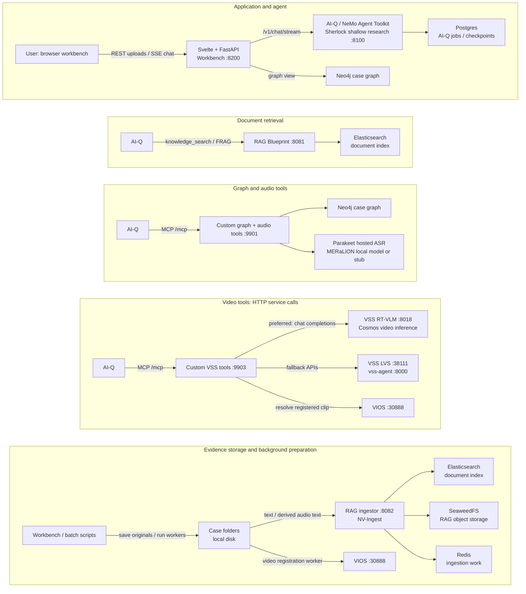

The browser talks to the Workbench, whose backend proxies chat to AI-Q. AI-Q
chooses retrieval and MCP tools in its tool loop. Upload processing runs separately
through Workbench subprocesses and batch scripts. The rows show service connections;
they are not sequential stages of one request. Video registration does not populate
a caption index or the case graph; the modality sections below explain these limits.

### 8.1 Installation and preparing demo data


Installation deploys services and registers tools. Batch scripts also seed/process
existing case data; user uploads later take a different path. Numbered phase names
reflect build history, so numerical order is not the full-video installation order.

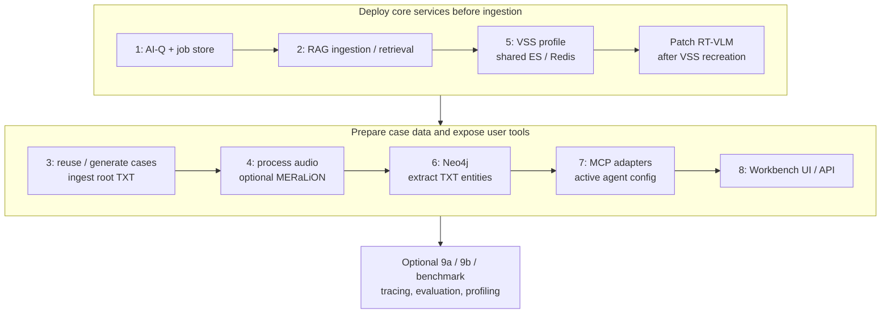

| Script | Service/config work | Data work and conditions |
|---|---|---|
| [phase1_aiq.sh](deploy/phase1_aiq.sh) | Clone/build AI-Q, apply Compose overlay and initial FRAG config | No case/media ingestion |
| [phase2_rag.sh](deploy/phase2_rag.sh) | Clone/deploy RAG, configure hosted model endpoints and infrastructure | Collection/service preparation; not automatic Workbench evidence analysis |
| [phase5_vss.sh](deploy/phase5_vss.sh) | Hardware-dependent VSS profile, model serving, ES/Redis ownership and RAG rewiring | Does **not** invoke `process_video.py` to register existing case videos |
| [patch_vss_rtvi_vlm.sh](deploy/patch_vss_rtvi_vlm.sh) | Apply the PoC's runtime VSS fixes | Reapply after recreation; not a video-processing job |
| [phase3_data_sim.sh](deploy/phase3_data_sim.sh) | Install Data Designer only if generating new cases | Reuse existing case folders; otherwise generate/convert Parquet; ingest root TXT into RAG |
| [phase4_audio.sh](deploy/phase4_audio.sh) | Prepare host audio dependencies; optional MERaLiON HTTP service | Process existing audio; with no audio it prints sample-generation instructions and exits before starting that service |
| [phase6_graph.sh](deploy/phase6_graph.sh) | Start Neo4j and initialize schema | Extract entities from root TXT, including audio analysis already produced |
| [phase7_extensions.sh](deploy/phase7_extensions.sh) | Start graph/audio and optional video MCP; copy active config/prompts | Does not turn the missing image worker into an implemented pipeline |
| [phase8_workbench.sh](deploy/phase8_workbench.sh) | Build/start Workbench | Makes user intake/chat available; no media backfill |

For a full video lab use **1 → 2 → 5 → patch → 3 → 4 → 6 → 7 → 8**. VSS must own
shared ES/Redis before ingestion to avoid losing/repeating indexed data. For a product
without video, select a compatible tool config as well as skipping the VSS services;
the full MCP config still references the video server. Hardware branches and dependency
packaging need validation on the actual target machine.

`deploy/start_all.sh` is a lifecycle script for an already prepared installation,
not a fresh installer or proof that all processing is ready. Runtime AI-Q runner
patches and network attachment also need checking after recreation; see
[patch_aiq_runner.sh](deploy/patch_aiq_runner.sh) and the developer guide.

Demo preparation is explicit: optional Magpie/Hokkien TTS creates audio; case video
files already placed on disk need registration, for example:

```bash
# After the selected VSS profile is healthy; substitute an existing case ID.
uv run data/video/process_video.py --case-id <case_id>
```

The reviewed tree contains **21 case metadata files**. That is a repository snapshot,
not evidence that every case/media item is ingested or every service is running.

### 8.2 Whole-case upload versus adding evidence


**Upload an entire case** currently means creating a new case from metadata form
fields and a **flat selection of files**. It is not a ZIP import, recursive folder
import, or restoration of an existing case identity. Workbench generates a new case
ID and writes `metadata.json`. It does not preserve an uploaded case manifest as a
validated registry record.

**Add evidence** targets an existing case ID. Both paths save original files by
extension: text-family files in the case root, images in `images/`, audio in `audio/`,
video in `video/`. Classification is not proof of successful content extraction.

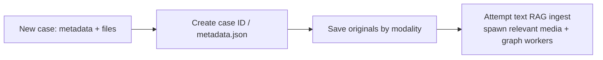

Existing-case intake is a separate path:

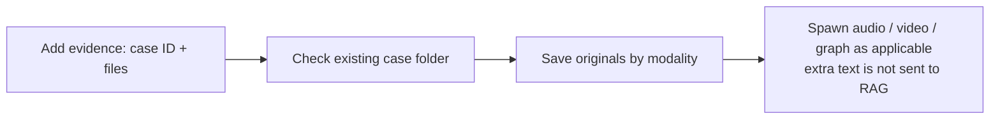

The handlers are [upload_case / upload_evidence](ui/server.py). New-case responses
report `pipelines_triggered`, including `image_caption_unavailable` for images;
existing-case uploads return `files_saved` and `status: uploaded`. The extra-evidence
handler does not dispatch text to RAG and does not return that image capability flag.

Workers are fire-and-forget subprocesses with output discarded. Launching graph
extraction last does not wait for audio transcripts to exist. Audio/video workers
scan the case rather than receiving a durable per-asset job. An upload acknowledgement
therefore means files were saved and processing attempted, not that retrieval or
analysis is ready. The modality sections below describe the intended worker path
when its dependencies, storage permissions and services are available.

### 8.3 Text and documents


**At setup:** Phase 3 reuses or generates synthetic cases and ingests root TXT; Phase
6 extracts root TXT entities. **New case:** Workbench attempts RAG ingestion for its
text extension set (`.txt`, `.pdf`, `.json`, `.csv`, `.md`, `.doc`, `.docx`) and launches
graph extraction. **Additional evidence:** root TXT can enter the graph, but this
endpoint does not ingest the new text into RAG. Graph ingestion reads TXT, not the
binary contents of PDF/DOCX; accepting an extension does not implement format conversion.

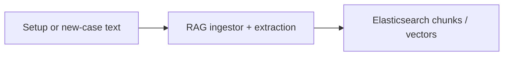

The graph-writing path is separate:

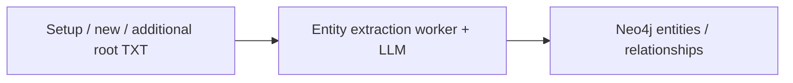

At question time, AI-Q selects FRAG retrieval and/or graph tools; those call paths
are shown separately in §2. Additional-text upload has no RAG edge today.

Source: [phase3_data_sim.sh](deploy/phase3_data_sim.sh),
[graph/ingest_entities.py](graph/ingest_entities.py), [graph/tools.py](graph/tools.py).
For a first workshop, use prepared plain-text evidence and verify retrieval before
questions. A consuming product can add a document extraction adapter, durable
per-asset ingestion state and consistent new-case/add-evidence dispatch.

### 8.4 Images


**At setup:** no active image-captioning worker is installed. **Either upload path:**
images are saved and viewable. **At question time:** there is no registered image
analysis tool or image-input routing from the Workbench to the model. Related text
may be searchable; the uploaded pixels have not become searchable evidence.

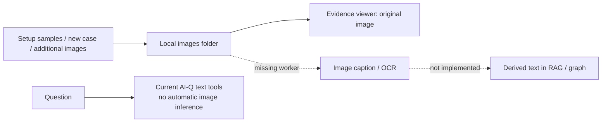

Source: [Workbench image dispatch](ui/server.py). `data/image/caption_images.py`
does not exist. The model name containing “Omni” does not change this wiring.

**Adaptation option:** use an appropriate vision NIM or Retriever extraction path,
keep the original image identifier, and index caption/OCR output with provenance.
Choose between question-time vision calls and upload-time extraction based on the
product's needs. These are proposed integrations, not current functionality.

### 8.5 Audio


**At setup:** Phase 4 processes audio already present; optional Magpie TTS generation
is a separate preparation step. **Either upload path:** Workbench spawns
`process_audio.py --case-id`. The explicit audio analysis endpoint processes one
uploaded file; MCP can also request analysis of an existing file.

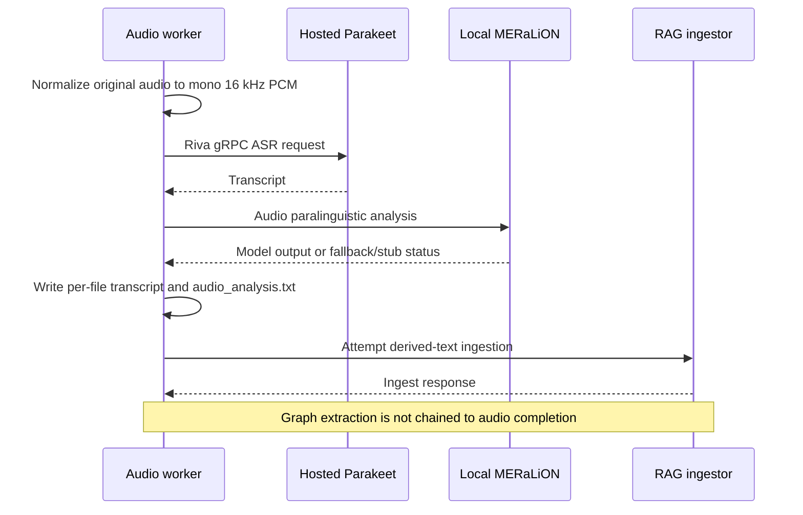

Questions can retrieve stored derived text or call the audio MCP tools for stored/fresh
analysis. Panels read the stored files; these are separate consumers of the output.

Source: [process_audio.py](data/audio/process_audio.py),
[meralion_server.py](data/audio/meralion_server.py), [Sherlock MCP](mcp/sherlock_mcp.py).
The configured ASR default is `ai-parakeet-1_1b-rnnt-multilingual-asr` through NVCF;
the request sets `language_code: en-US`. Model selection is configurable, but there
is no implemented automatic language/model router.

The script writes `audio/<stem>_transcript.txt` and aggregates transcript/paralinguistic
text in `audio_analysis.txt`, then attempts RAG ingestion. MERaLiON uses configurable
windows; missing prerequisites produce a stub. Model outputs such as stress/emotion
are estimates, not factual judgments about a speaker. Display actual status and
verify derived text rather than inferring success from file existence.

There is no graph job chained to audio completion. The installation order makes
Phase 6 see prior Phase 4 results, while upload-time graph extraction may run too early.
The Docker Workbench/MCP paths also have dependency/write-permission gaps, so a host
`uv run` demonstration does not establish that every UI/MCP execution path works.
A product can reuse Speech NIM independently of MERaLiON and own its transcript
storage, language routing and completion events.

### 8.6 Video


**At setup:** Phase 5 selects and deploys a VSS profile. A question calls services
from that running profile; it does not generate a new profile. **Either upload path:**
`process_video.py` registers videos with VIOS. **At question time:** AI-Q chooses a
video tool, which resolves a registered clip URL and performs fresh inference.
Here “on demand” means processing in response to a question, not live-camera streaming
or a guaranteed response time.

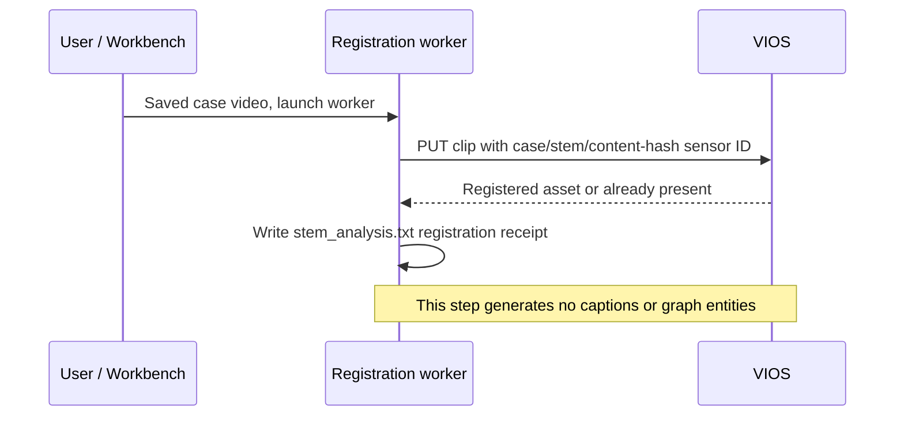

The question-time inference path starts after registration:

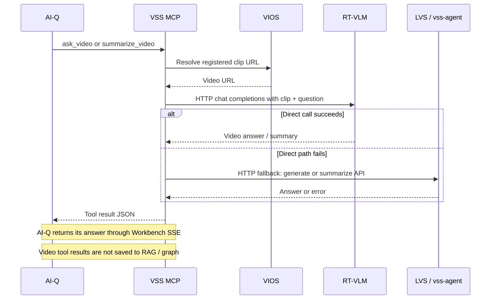

Source: [process_video.py](data/video/process_video.py) and
[vss_sherlock_mcp.py](mcp/vss_sherlock_mcp.py). The registration sensor ID includes
case ID, filename stem and a content hash. `<stem>_analysis.txt` is a **registration
receipt**, despite its name. Generic root-TXT ingestion can pick up this receipt,
which still does not make it a video caption or observation.

The preferred path is direct HTTP to RT-VLM, bypassing the additional VSS agent loop.
`ask_video` can fall back to `vss-agent /generate`; `summarize_video` can fall back to
LVS `/v1/summarize` and then `vss-agent /generate`. HTTP is the transport for these
services too. Developers can choose direct inference, the VSS agent, or their own
orchestrator independently of **when** they process/index a clip.

Do not carry historical “4 seconds” or model-memory figures into a generic promise.
Verify the active `/v1/models`, selected hardware/profile and the exact fallback path
for a workshop. Local file presence, VIOS registration, inference readiness and a
persisted analysis artifact are four different states.

#### Product choice: on-demand, upload-time or hybrid

| Approach | Benefit | Product work / tradeoff |
|---|---|---|
| Current on-demand Q&A | Simple intake; question-specific reasoning; little baseline analysis at upload | Question latency/compute repeats; no caption corpus for cross-modal retrieval; receipt-based UI readiness is coarse |
| Analyze/index on upload | Timestamped captions/observations become searchable with documents and entities | Background jobs, processing UX and indexing cost; captions are lossy and may not answer an unforeseen question |
| Hybrid | Search baseline observations, then inspect the original clip for a focused question | Requires asset/chunk identity and provenance across baseline indexing and fresh inference |

For a developer extending this demo into a usable evidence product, **hybrid is a
reasonable candidate**. Keep it optional for the introductory lab: first teach the
video inference contract, then show how the product can own background analysis and
retrieval. Treat direct inference versus VSS agent orchestration as another independent
choice rather than replacing one solely to obtain better upload UX.

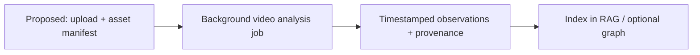

A later question can search those observations and invoke fresh video inference for
a focused check. The product would expose uploaded/registered/processing/ready/failed
states from the job. Those UX/state contracts are proposed, not implemented.

This proposed path needs stable asset IDs, content hashes, timestamps, model/version
metadata, retryable jobs and visible partial/failure states. An answer should distinguish
indexed observations from fresh model output. None of this is wired into the current
upload worker; replacing the user's storage or adopting every VSS component is optional.

---

## 9. NVIDIA modules and workshop slide preparation


The stack contains **blueprints, a toolkit, an SDK, model services and tools**.
Calling all of these “SDKs” would hide the integration choices developers need to make.
The following is the workshop inventory; prepare a capability slide and one bounded
example for each topic, grouping related topics when time is limited.

| Topic | Kind / use in this PoC | Slide or lab material to prepare |
|---|---|---|
| [AI-Q Blueprint](https://docs.nvidia.com/aiq-blueprint/2.1.0/examples/full-pipeline-web.html) | Reference application; installer default `v2.1.0` | Active shallow workflow YAML; question → tool → cited answer; optional upstream deep workflow as a separate capability |
| [NeMo Agent Toolkit (NAT)](https://docs.nvidia.com/nemo/agent-toolkit/latest/index.html) | Agent runtime/integration toolkit through AI-Q; tracing and `nat eval` | Function/MCP registration, a Phoenix trace, evaluation dataset and rubric; use the installed AI-Q-compatible NAT version |
| [RAG Blueprint](https://github.com/NVIDIA-AI-Blueprints/rag/tree/v2.6.0) | Installer default `v2.6.0`; ingestion and FRAG retrieval | Separate ingestion/search contracts, chunk provenance, a pre-ingested TXT example |
| [NeMo Retriever extraction / NV-Ingest](https://docs.nvidia.com/nemo/retriever/25.6.2/extraction/notebooks/) | Extraction service used through RAG | Extraction → chunks → embeddings; supported-format and resource considerations; distinguish upstream capabilities from this app's image gap |
| NeMo Retriever embedding / reranking NIMs | Hosted `llama-nemotron-embed-vl-1b-v2` and `llama-nemotron-rerank-vl-1b-v2` in the RAG deployment config | Similarity search versus reranking, one retrieval result, endpoint/model configuration from the pinned [RAG environment](https://github.com/NVIDIA-AI-Blueprints/rag/blob/v2.6.0/deploy/compose/nvdev.env) |
| Nemotron reasoning models | Hosted agent and entity-extraction models | Current configured model ID, thinking/tool calling, structured entity output; the “Omni” name alone does not wire media inputs |
| [Riva Python client](https://docs.nvidia.com/deeplearning/riva/user-guide/docs/apis/development-python.html) | Direct SDK: `nvidia-riva-client` / `riva.client` | gRPC client, audio normalization and local-versus-NVCF connection example |
| [Parakeet Speech NIM](https://docs.nvidia.com/nim/speech/latest/get-started/index.html) | Hosted ASR in the current processing script | A short synthetic WAV → transcript; model/language choice and a local Speech NIM adoption path |
| [Magpie TTS](https://docs.nvidia.com/deeplearning/riva/user-guide/docs/public/tts/tts-overview.html) | Optional speech generation for demo data | Text → synthetic statement; distinguish sample preparation from runtime ASR |
| [NeMo Data Designer](https://docs.nvidia.com/nemo/datadesigner/getting-started/welcome) | Optional synthetic case generation | Case schema, generation configuration and packaged case output; no need to regenerate existing cases |
| [Video Search and Summarization (VSS)](https://docs.nvidia.com/vss/latest/index.html) | Video blueprint; `vss-3.2.0` directory with hardware-specific `3.2.1` / SBSA image choices | Profile/service map, VIOS registration, on-demand video question, fallback paths; broader VSS search features are not this app's implemented flow |
| [Cosmos Reason models](https://nvidia-cosmos.github.io/cosmos-cookbook/recipes/inference/reason2/vss/inference.html) | VSS video reasoning; local RT-VLM path or hardware-dependent remote path | Timestamped clip/question/output; capture `/v1/models` on the actual lab host because script defaults and MCP model aliases differ |
| [AIPerf](https://github.com/ai-dynamo/aiperf) | Implemented inference benchmarking tooling | Workload, request rate, latency/throughput and a small validated result; benchmark evidence is hardware/config-specific |
| [Nsight Systems](https://docs.nvidia.com/nsight-systems/UserGuide/index.html) | Implemented profiling workflow | GPU timeline showing inference/resource contention; correlate it with the workload rather than treating all process activity as overlap |

Operational appendix topics: **NVIDIA API Catalog, NGC and NVIDIA Cloud Functions
(NVCF)**; **NVIDIA Container Toolkit/CUDA and `nvidia-smi`**; hardware profiles and
memory scheduling. These explain distribution, hosting and deployment rather than
adding another agent capability.

Keep third-party modules clearly attributed: **MERaLiON** is an A*STAR audio model,
not an NVIDIA SDK; FastMCP, FastAPI, Svelte, Neo4j, NetworkX, SeaweedFS, Elasticsearch,
Redis, Postgres and Phoenix are supporting software. OpenAI's `gpt-oss-120b` is a
configured evaluation judge served through NVIDIA's endpoint. NeMo Guardrails has a
**draft policy only** here; cuGraph acceleration and image captioning are **not wired**.
Do not present these as completed workshop labs.

For each reusable module, show **input → API/tool contract → output**, endpoint location,
required hardware, how to substitute the endpoint, and what the consuming app must own
(storage, authorization, processing state and UX). Existing product orchestrators can
call the underlying HTTP/gRPC APIs directly or reuse an MCP wrapper.

### 9.1 Hosted APIs, NGC distribution and local-serving adaptation


Use **NVIDIA API Catalog** for discovering/trying hosted model APIs; use **NGC** for
container/model distribution. Downloading a NIM image from NGC and calling a hosted
inference endpoint are different operations. Local NIM serving also exposes an API;
check model-specific local availability and hardware support before selecting it.
See NVIDIA's [NIM deployment guide](https://docs.nvidia.com/nim/large-language-models/1.15.0/getting-started.html).

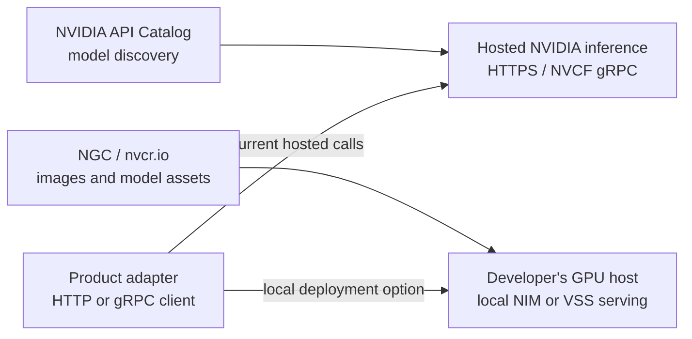

| Capability | Checked-in default / path | What an all-local product needs to change |
|---|---|---|
| AI-Q reasoning | `integrate.api.nvidia.com/v1`; active Nano Omni reasoning model | All relevant NAT LLM role base URLs, served model names and authentication |
| Graph extraction | Hosted OpenAI-compatible endpoint; `LLM_BASE_URL`, `LLM_NAME` | Graph worker and MCP environment, independently of AI-Q's configuration |
| RAG models | Hosted generation, embedding, reranking and extraction endpoints in upstream `nvdev.env` | Every required RAG/NV-Ingest model endpoint, including extraction/OCR/layout dependencies for selected formats |
| ASR | `grpc.nvcf.nvidia.com:443`, runtime function discovery | A local Speech NIM endpoint plus changes to the NVCF-specific connection/auth/discovery code; this is not an env-only switch today |
| MERaLiON | Local HTTP service preferred, then in-process Transformers; stub without prerequisites | Compatible GPU, prepared model weights, dependencies and writable outputs |
| Video | Local RT-VLM on suitable VSS paths; other hardware paths can use remote inference; VSS reasoning LLM defaults hosted | VSS profile, VLM/LLM endpoint and model configuration; validate the served model identity |
| Synthetic speech / cases / eval | Hosted calls when generation or judging is invoked | Local compatible TTS/generation/judge services, or prepare examples before the workshop |

[NVIDIA Speech NIM](https://docs.nvidia.com/nim/speech/latest/get-started/index.html)
is the local ASR/TTS service adoption path; Riva is the client SDK used here.
`NVIDIA_API_KEY` is used for hosted inference, `NGC_API_KEY` for registry access, and
`HF_TOKEN` for applicable Hugging Face models. These are roles in this repository;
check account permissions without treating the keys as interchangeable.

**All-local inference** is a viable adaptation, but it is not this PoC's implemented
installation mode. **Offline installation/runtime** additionally requires preparing
images, model weights, Python/npm dependencies and replacing online discovery/downloads.
Switching off web search or moving only the agent LLM does not accomplish that.

### 9.2 Workshop topics by category and module adoption

Sherlock's **14 workshop topics span six categories**: agents and reasoning,
enterprise retrieval, video and physical AI, benchmarking and profiling,
synthetic data, and speech and voice. Each category covers the NVIDIA
capabilities demonstrated in the PoC, their role in Sherlock, and their
potential use in a developer's product architecture.

These are teaching topics, rather than 14 distinct SDKs. The NVIDIA Agent Toolkit
topic covers the platform overview, while NeMo Agent Toolkit covers the runtime
and integration used through AI-Q. Extraction, embedding and reranking are grouped
as one NeMo Retriever topic.

1. **Agents and reasoning — 3 topics:** NVIDIA Agent Toolkit, NeMo Agent Toolkit
   and Nemotron reasoning models. Present this category under **NVIDIA Agent
   Toolkit**, explaining the **Relay/Platform direction** separately from the
   AI-Q/NAT workflow implemented in this PoC. Show agent/tool integration and
   reasoning-model choices so developers can select the framework or model
   capabilities that fit their existing orchestration.

2. **AI-Q and enterprise retrieval — 3 topics:** AI-Q Blueprint, RAG Blueprint
   and NeMo Retriever, including NV-Ingest/extraction, embedding and reranking
   NIMs. **Cover AI-Q in depth**, including its configured workflow, tool calls
   and cited-answer synthesis. Explain NeMo Retriever's role across extraction,
   embedding and retrieval, and how Sherlock currently connects AI-Q to the RAG
   Blueprint. Developers can select the agent layer, knowledge pipeline or
   individual model services. Use the
   [multimodal RAG pipeline reference](docs/MULTIMODAL_RAG_PIPELINE.md) for stage
   ordering and modality-specific ingestion choices.

3. **Video and physical AI — 2 topics:** VSS and Cosmos Reason. Present
   **Metropolis VSS** modular services alongside **Cosmos** models. Show video
   registration, the selected inference service and its HTTP contract, then
   explain how a product can adopt video services or model inference within its
   own workflow. Distinguish Sherlock's current on-demand questions from the
   proposed upload-time captioning/indexing path in §8.6.

4. **Benchmarking and profiling — 2 topics:** AIPerf and Nsight Systems.
   These are **performance tools**: AIPerf measures inference latency and
   throughput under a defined workload; Nsight Systems helps inspect CPU/GPU
   execution and resource contention. Developers can use either tool to assess
   their selected components and deployment hardware.

5. **Synthetic data — 1 topic:** NeMo Data Designer. Position it within
   **NeMo data generation and customization**. Use Sherlock's synthetic cases
   to illustrate schemas, generation configuration and reusable output. A
   developer can adopt Data Designer for their own data workflow independently
   of the runtime agent and retrieval stack.

6. **Speech and voice — 3 topics:** Riva client, Parakeet ASR and Magpie TTS.
   Use **Nemotron Speech** as the current model-family story, while explaining
   the **Riva client** and **Speech NIM serving interface** used by the
   implementation. Show transcription and speech generation as separate
   capabilities. Parakeet handles Sherlock's audio transcription; Magpie is used
   to prepare synthetic audio evidence. Developers can select ASR, TTS or both
   and integrate the appropriate serving interface into their product.

For each category, prepare the capability overview, a bounded Sherlock example
and the adoption choices: input/output contract, hosted or local serving, required
hardware and integration points. Keep product-family direction separate from
implemented versions; §9 and the [model inventory](DESIGN-EXT.md#model-inventory)
record the PoC's component settings. The consuming product owns its storage,
processing state and user experience.
