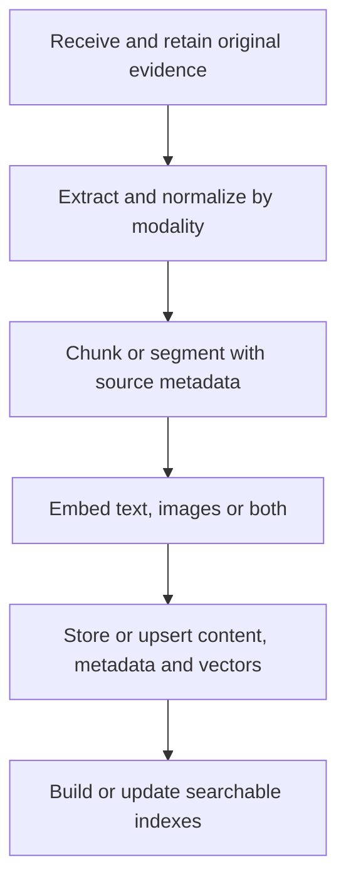
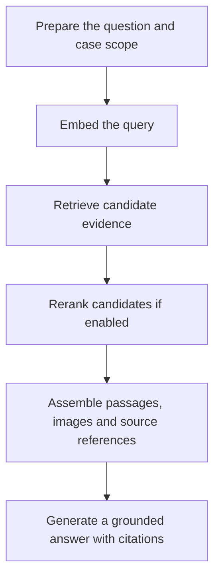

# Multimodal RAG Pipeline: Phases, Models and NVIDIA Blueprints

**Reference date:** 2026-10-04.

**Purpose:** preserve the RAG pipeline discussion for Sherlock architecture planning and developer workshops.

**Status:** reference design and model map; the proposed ingestion changes and model upgrades have not been applied.

Sherlock currently uses AI-Q Blueprint `v2.1.0`, RAG Blueprint `v2.6.0` and VSS `v3.2.0` through its installation scripts. The newer released-stack examples below refer to NeMo Retriever `26.8.2` and RAG Blueprint `v2.6.2`; they are not changes to Sherlock's installed configuration. See the [existing model inventory](../DESIGN-EXT.md#model-inventory).

## 1. The two main phases

The pipeline has two main phases:

1. **Prepare and index evidence when files are uploaded.**
2. **Retrieve evidence and generate an answer when a question arrives.**

**Ingestion** usually names the entire first phase. It is not necessarily a separate step between chunking and indexing. **Database ingestion** specifically means writing or upserting content, metadata and vectors into the knowledge store.

### Phase 1: Evidence ingestion

**Receive → Extract/normalize → Chunk/segment → Embed → Store/upsert → Index**

| Step | Responsibility | Output |
|---|---|---|
| Receive | Retain the original file and assign case/evidence identifiers. | Original evidence, source URI and provenance. |
| Extract/normalize | Decode files and obtain text, images, structured elements, transcripts or video descriptions. | Evidence units that downstream processing can use. |
| Chunk/segment | Split units at useful boundaries and attach metadata. | Text passages, page images/crops, transcript segments or video time windows. |
| Embed | Encode supported evidence units into retrieval vectors. | Document/text/image vectors. |
| Store/upsert | Write content, vectors and metadata; retain links to original assets. | Persistent evidence records and vector collections. |
| Index | Make records searchable through vector, keyword or hybrid indexes. | Searchable knowledge store. |

Source references must survive the entire pipeline: case ID, evidence ID, document/page ID, original asset URI, timestamps where applicable and extraction/model versions. These are metadata responsibilities, not a final model call.

Storage and indexing may happen together through the database's write API. Chunking, storage and indexing do not require separate neural models.

### Phase 2: Retrieval and answer generation

**Prepare question → Embed query → Retrieve candidates → Rerank (optional) → Assemble context → Generate answer + citations**

| Step | Responsibility | Output |
|---|---|---|
| Prepare question | Apply the appropriate case scope; optionally route, rewrite or decompose the question. | Search request or agent tool calls. |
| Embed query | Encode the query using the embedding model and input format compatible with the indexed corpus. | Query vector. |
| Retrieve | Search vector/keyword indexes and apply supported metadata filters. | Candidate passages or visual evidence units. |
| Rerank | Optionally score query–candidate pairs and reorder the results. | A more relevant candidate ordering. |
| Assemble context | Select evidence, resolve image/source references and retain citations. | Context usable by the answer LLM/VLM. |
| Generate | Reason over the supplied evidence and produce an answer with source references. | Grounded response. |

Reranking happens **after retrieval**, not during document upload. An agent may repeat retrieval when the first results do not answer the question. Query rewriting and reranking are optional; a simple RAG flow can omit them.

## 2. How each modality enters the pipeline

| Input | Extraction/normalization | Chunking or segmentation | What can be embedded | References to preserve |
|---|---|---|---|---|
| Text | Decode text or extract born-digital document text. | Paragraphs, sections or bounded passages. | Text passages. | Document ID, section/page and source URI. |
| Image | Retain the image; optionally create crops, OCR text or a VLM caption. | Whole image, page or region; separately chunk any extracted text. | Images/crops directly, text descriptions, or supported text/image combinations. | Image ID, crop coordinates where available and source URI. |
| Audio | Transcribe speech; optionally add speaker labels and other annotations. | Timestamped transcript segments. | Transcript text in the pipeline discussed here. | Audio ID, start/end time and speaker label where available. |
| Video | Generate timestamped captions/events and keyframes through VSS; optionally transcribe the audio track. | Time windows, caption/transcript segments and keyframes. | Caption/transcript text and supported keyframe images. | Video ID, time range, keyframe URI and original video URI. |
| Mixed PDF | Extract text blocks, images and selected table/chart content; use OCR or a parser for scanned/complex pages. | Text passages and linked visual evidence units. | Text, page images/crops or supported text/image combinations. | Parent document ID, page number, element ID and relationships between units. |

A mixed PDF should preserve the relationship between its text, tables and images. It does not require every element to become a caption or every extraction model to run in sequence. Select the extraction path that fits the content: direct text extraction, layout/OCR, or an alternative structured parser.

Selecting a VL embedding model alone does **not** enable image indexing. NeMo Retriever's documented default embedding modality is text; image or `text_image` embedding must be selected explicitly. Likewise, retrieving an image vector does not automatically pass the image to the answer model: the application must supply the image/crop to a VLM, or provide usable extracted text/captions. [Embedding reference](https://github.com/NVIDIA/NeMo-Retriever/blob/26.8.2/docs/docs/extraction/embedding.md)

For Sherlock's proposed next phase, video captions can be generated on upload and indexed alongside audio transcripts. Native image/page embeddings can be added as another ingestion path, preserving the same case/evidence metadata. This is a proposed flow, not the current real-time VSS implementation.

## 3. Model, NIM, library and Blueprint are different layers

| Layer | Responsibility | Examples |
|---|---|---|
| Model | Performs an individual learned task. | OCR, Parse, Embed, Rerank, Parakeet, Cosmos and a Nemotron answer LLM/VLM. |
| NVIDIA NIM | Packages and serves model inference through supported deployment/API interfaces. | Embedding, reranking, OCR and speech NIMs. |
| NeMo Retriever Library | Provides extraction, embedding and retrieval software with model and storage integrations. | Document/media processing and retrieval services. |
| RAG Blueprint | Wires a reference knowledge application, including ingestion, retrieval and optional generation. | Sherlock's current knowledge backend. |
| AI-Q Blueprint / NeMo Agent Toolkit | Orchestrates agents and tools, including knowledge search and answer synthesis. | Sherlock's lead agent. |
| VSS Blueprint | Provides video search, summarization and video-understanding workflows. | Sherlock's video service and a possible caption producer for ingestion. |

There is no requirement for one Blueprint or a different small model at every stage. An agent LLM can be reused for planning, query rewriting and generation where appropriate.

## 4. RAG stages and their NVIDIA components

### Ingestion stages

| Stage | NVIDIA model or software | Owning library / Blueprint | Necessity or implementation note |
|---|---|---|---|
| Receive, upload and track files | Application software; no neural model required. | Sherlock workbench; RAG Blueprint ingestor; NeMo Retriever service. | Preserve provenance and document lifecycle. |
| Decode and normalize formats | PDFium, document converters and FFmpeg; no neural model required. | NeMo Retriever and upstream media processors. | Decode before extraction/inference. |
| Detect page layout | **Nemotron Page Elements v3**. | NeMo Retriever / RAG Blueprint; object-detection NIM. | Used by applicable visual-document extraction paths. |
| Read scanned text | **Nemotron OCR v2** in Retriever 26.8.2; **OCR v1** in Sherlock's configured blueprint stack. | NeMo Retriever / RAG Blueprint; OCR NIM. | Needed for scanned text when a text-extraction path is selected. |
| Recover table/chart content | **Nemotron Table Structure v1**; **Nemotron Graphic Elements v1** in RAG Blueprint settings; OCR for visual text. | NeMo Retriever / RAG Blueprint extraction. | Sherlock's installer disables table/chart extraction on the reviewed default path. |
| Alternative structured parsing | **Nemotron Parse v1.2** in the released Retriever support matrix. | NeMo Retriever optional `nemotron_parse` method; Parse NIM. | Alternative extraction path. Parse v1.2 does not emit chart-specific modality rows. |
| Caption/interpret images | **Nemotron 3 Nano Omni 30B A3B Reasoning** in current Retriever captioning; **Nemotron Nano 12B v2 VL** in RAG Blueprint caption defaults. | NeMo Retriever / RAG Blueprint; VLM serving. | Optional enrichment. Sherlock's reviewed default path disables blueprint image captioning. |
| Transcribe audio | **Parakeet 1.1B**: Sherlock uses multilingual RNNT; Retriever's documented audio path uses CTC en-US. **Canary 1B** is a selectable Sherlock alternative. | Speech NIM / Riva client; NeMo Retriever optional audio extraction. | Audio/video speech becomes timestamped text. |
| Describe video segments | **Cosmos Reason2-8B**, recorded for Sherlock; **Reason1-7B** remains an installer alternative. | **VSS Blueprint** with a configurable VLM. | Produces temporal video descriptions; an image embedder does not replace this workflow. |
| Clean, deduplicate, chunk and attach metadata | Software; optional configurable LLM enrichment. | NeMo Retriever / RAG Blueprint ingestor; Sherlock processing. | No dedicated model is required for ordinary chunking. |
| Create evidence embeddings | **Llama Nemotron Embed VL 1B v2** in Sherlock. | Embedding inference called by NeMo Retriever / RAG Blueprint. | Core model for dense text/visual retrieval. |
| Store vectors and build indexes | Database/object-storage software; no neural model required. | RAG Blueprint's configured database; NeMo Retriever / LanceDB integrations. | Sherlock uses Elasticsearch for the knowledge store. |

Retriever 26.8.2 uses the same `nemotron-object-detection` NIM container family to serve page-elements and table-structure models as separate model services. The container name is deployment packaging, not another RAG model. [Released support matrix](https://github.com/NVIDIA/NeMo-Retriever/blob/26.8.2/docs/docs/extraction/prerequisites-support-matrix.md)

### Query and answer stages

| Stage | NVIDIA model or software | Owning library / Blueprint | Necessity or implementation note |
|---|---|---|---|
| Route, rewrite or decompose a question | Configurable **Nemotron LLM**. | AI-Q / NeMo Agent Toolkit; optional agentic RAG Blueprint functions. | Optional. Reuse the agent model rather than requiring separate models for every planning step. |
| Embed the query | **The same embedding model used for the indexed evidence**. | NeMo Retriever / RAG Blueprint embedding client. | Use the correct query/document input formats. |
| Retrieve candidates | Vector/keyword/hybrid search software; no additional neural model required. | NeMo Retriever or RAG Blueprint search endpoint and database. | Search is distinct from creating embeddings. |
| Rerank candidates | **Llama Nemotron Rerank VL 1B v2** in Sherlock's configuration. | Reranking NIM; NeMo Retriever / RAG Blueprint. | Optional. Retriever 26.8.2 exposes `rerank=true`; the caller must enable it. |
| Assemble context and citations | Application software; optional LLM context compression. | AI-Q / Sherlock tools and retrieval-response formatting. | Deliver actual passages/images and usable references to the answer model. |
| Generate a grounded answer | Sherlock: **Nemotron 3 Nano Omni 30B A3B Reasoning**. Sherlock's RAG Blueprint also configures **Nemotron 3 Super 120B A12B** for its generation roles; RAG v2.6.2 hosted defaults use **Nemotron 3 Ultra 550B A55B**. | AI-Q / NeMo Agent Toolkit, or RAG Blueprint generation. | Sherlock's current FRAG path retrieves evidence for AI-Q synthesis; configured blueprint generation models are not additional mandatory answer calls. |

### Optional enrichment, validation and output

| Stage | NVIDIA model or framework | Owning component | Relationship to RAG |
|---|---|---|---|
| Speaker attribution | **Nemotron 3 Diarization** is described in internal messaging; **Nemotron 3.5 Transcribe** also describes speaker attribution. | Speech processing. | Optional annotation. Diarization labels speaker turns, not real-world identity; release availability was not verified here. |
| Entity extraction / knowledge graph | Configurable **Nemotron LLM**; Sherlock currently reuses Nano Omni reasoning. | Sherlock custom tools and Neo4j graph workflow. | Separate application enrichment; embedding vectors do not create entity relationships. |
| Guardrails and evaluation | **NeMo Guardrails**, rules/metrics and a configurable judge model. | Application, AI-Q/NAT or RAG Blueprint evaluation. | Cross-cutting checks rather than a required single model stage. Sherlock's configured evaluation judge is non-NVIDIA OpenAI `gpt-oss-120b`. |
| Speech output | **Magpie TTS**; **Nemotron 3 TTS** is its described successor. | Speech serving/application. | Optional output, not an ingestion or retrieval dependency. Sherlock currently uses Magpie for synthetic evidence generation, not a required spoken-answer stage. |

## 5. Where Nemotron 3.5 Embed VL 1B fits

**Nemotron 3.5 Embed VL 1B can replace the embedding component currently served by Llama Nemotron Embed VL 1B v2, subject to integration validation. It does not replace NeMo Retriever Library or the RAG Blueprint.**

The internal product-family direction is:

| New family | Pipeline responsibility | Availability established by the material reviewed |
|---|---|---|
| **Nemotron 3.5 Parse** | Structured document extraction. | Named in internal partner messaging; current EA/release availability not established by the EA notes reviewed. |
| **Nemotron 3.5 Embed VL 1B** | Evidence and query embeddings. | Included in the current EA programme. |
| **Nemotron 3.5 Rerank** | Relevance ordering of retrieved candidates. | Named in internal partner messaging; current EA/release availability not established by the EA notes reviewed. |
| **Nemotron 3.5 Super VL** | Visual reasoning, agents and answer generation. | Included in the current EA programme. |
| **Nemotron 3.5 Transcribe** | Recorded-audio transcription/understanding. | Included in the EA programme; the planned October 2 checkpoint release was not independently confirmed. |
| **Nemotron 3 TTS** | Spoken output. | Described successor to Magpie; checkpoint/NIM EA timing remained TBD in the October 1 notes. |

The new embedding model creates vectors. It does not transcribe audio, perform temporal video analysis, extract structured tables, rerank query–candidate pairs or generate the final answer.

Before changing the embedder:

1. Validate the actual checkpoint/API, tokenizer, query/document formatting, dimensions and supported visual inputs against the chosen pipeline.
2. Re-embed the existing corpus and create/update a compatible collection and index.
3. Switch document and query embedding together. Equal vector dimensions do not establish compatible vector spaces.
4. Evaluate retrieval and grounded answers, including image/page retrieval when enabled.

The reranker remains an independently selectable model. A new embedding model is not evidence that the existing extraction or reranking stages can be removed.

## 6. A modular baseline for Sherlock and workshops

The proposed composition is **AI-Q agent + a knowledge retrieval service + case storage + modality-specific processors**.

- Start with text passages, audio transcripts and video captions using the shared text ingestion pipeline.
- Add native image/page embeddings when the demonstration needs visual retrieval.
- Select OCR, table/chart extraction or Parse according to the documents; do not require every extraction model for every upload.
- Add reranking when it improves retrieval for the target evidence.
- Keep VSS and speech processing as upstream modules that produce evidence units with source references.

RAG Blueprint and NeMo Retriever Library are alternative ways to compose the knowledge layer; adopting the library is an architectural integration decision, not a consequence of selecting Nemotron 3.5 Embed VL 1B.

## Sources

### Sherlock implementation

- [Model inventory](../DESIGN-EXT.md#model-inventory).
- [AI-Q installation/version pin](../deploy/phase1_aiq.sh) and [active agent configuration](../deploy/aiq-configs/config_sherlock_frag_mcp.yml).
- [RAG installation, reranker override and extraction switches](../deploy/phase2_rag.sh).
- [VSS installation/version pin](../deploy/phase5_vss.sh), [VSS MCP model selection](../mcp/vss_sherlock_mcp.py) and [recorded Cosmos deployment](../benchmark/examples/rtx_pro6000-2026-08-31/summary.md).
- [Audio processing and selectable ASR models](../data/audio/process_audio.py), [synthetic speech generation](../data/sim/generate_audio_samples.py) and [evaluation configuration](../deploy/aiq-configs/eval_fragment.yml).

### Versioned released-stack references

- [NeMo Retriever 26.8.2 support matrix](https://github.com/NVIDIA/NeMo-Retriever/blob/26.8.2/docs/docs/extraction/prerequisites-support-matrix.md).
- [NeMo Retriever 26.8.2 extraction paths](https://github.com/NVIDIA/NeMo-Retriever/blob/26.8.2/docs/docs/extraction/multimodal-extraction.md).
- [NeMo Retriever 26.8.2 embedding modes](https://github.com/NVIDIA/NeMo-Retriever/blob/26.8.2/docs/docs/extraction/embedding.md).
- [NeMo Retriever 26.8.2 audio/video ingestion](https://github.com/NVIDIA/NeMo-Retriever/blob/26.8.2/docs/docs/extraction/audio-video.md).
- [RAG Blueprint v2.6.2 model configuration](https://github.com/NVIDIA-AI-Blueprints/rag/blob/v2.6.2/deploy/compose/nvdev.env).

### Internal product and EA references

- [Nemotron 3.5 Super VL, Retriever and Speech Partner Messaging](https://docs.google.com/document/d/1XDSqgT7_8j9cVHDVL6b9n1h1HUWIaojBnbbgsaMO2AY/edit); [Parse / Embed / Rerank tab](https://docs.google.com/document/d/1XDSqgT7_8j9cVHDVL6b9n1h1HUWIaojBnbbgsaMO2AY/edit?tab=t.68sf3uyg35l0).
- [October 1 Nemotron Models Weekly EA & Partner Activation notes](https://outlook.office365.com/owa/?ItemID=AAMkADI5NzE4ODJmLTBlZTItNGNjOC1hODJlLTNiZTMyNTY5ZGY3NgBGAAAAAAC1Cv1ZHuJ0Q5cb9hJeS9BLBwBcx3QHDTopQ6m9rpNrf5oHAAAAAAEMAACUk%2Fj1nQeWTrgBC08LVVp1AACy7g7aAAA%3D&exvsurl=1&viewmodel=ReadMessageItem), received October 3 Singapore time.

Internal messaging describes product direction; it is kept separate from released model names and Sherlock's verified configuration. This reference reflects the October 4 review and should be refreshed before choosing later release versions.
